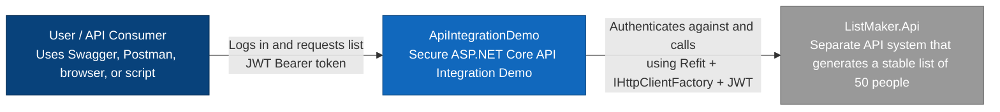

# C4 Model — System Context Diagram

## Purpose

This diagram shows the highest-level view of `ApiIntegrationDemo`.

The system demonstrates secure communication between:

- an external user/client
- `ListReader.Api`
- `ListMaker.Api`

The main user-facing API is `ListReader.Api`.  
`ListReader.Api` authenticates the user, then calls `ListMaker.Api` by using a service credential flow.

---

## System Context Diagram


---

## Main Actors

| Actor | Description |
|---|---|
| User / API Consumer | Calls `ListReader.Api` through Swagger, Postman, k6, or another HTTP client |
| ApiIntegrationDemo | Demo solution containing both APIs and shared client/contracts |
| ListMaker.Api | Separate API that provides the generated list |

---

## System Responsibilities

`ApiIntegrationDemo` demonstrates:

1. Login to `ListReader.Api`.
2. JWT protection on `ListReader.Api`.
3. API-to-API login from `ListReader.Api` to `ListMaker.Api`.
4. Token caching for the `ListMaker.Api` token.
5. Refit-based downstream communication.
6. Returning `ListMaker.Api` list data through `ListReader.Api`.

---

## Key Architectural Notes

Although both APIs live in the same monorepo for demo purposes, they represent two separate systems:

```text
ListReader.Api ---> ListMaker.Api
```

`ListReader.Api` does not directly access ListMaker internals.  
It communicates through HTTP using Refit client interfaces.

This preserves a service boundary suitable for microservice-style architecture.

