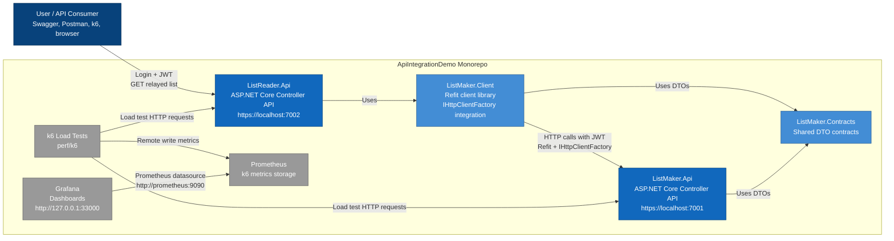

# C4 Model — Container Diagram

## Purpose

This diagram shows the main deployable/runtime containers in `ApiIntegrationDemo`.

The core runtime containers are:

- `ListReader.Api`
- `ListMaker.Api`
- Prometheus
- Grafana

The supporting code-level containers/libraries are:

- `ListMaker.Client`
- `ListMaker.Contracts`

---

## Container Diagram


---

## Containers

| Container | Type | Responsibility |
|---|---|---|
| `ListReader.Api` | ASP.NET Core Web API | Main consumer-facing API; authenticates users and relays list data |
| `ListMaker.Api` | ASP.NET Core Web API | Authenticates service calls and returns generated list data |
| `ListMaker.Client` | C# class library | Refit interfaces and dependency injection for calling `ListMaker.Api` |
| `ListMaker.Contracts` | C# class library | Shared request/response DTOs |
| k6 | Load testing tool | Executes HTTP load tests |
| Prometheus | Metrics store | Receives k6 metrics through remote write |
| Grafana | Dashboard tool | Visualizes k6/Prometheus metrics |

---

## Runtime Ports

| Runtime Component | URL |
|---|---|
| `ListMaker.Api` | `https://localhost:7001` |
| `ListReader.Api` | `https://localhost:7002` |
| Grafana | `http://127.0.0.1:33000` |

---

## API Communication

The main API-to-API flow is:

```text
User
  -> ListReader.Api
-> ListMaker.Client
-> ListMaker.Api
```

`ListReader.Api` authenticates to `ListMaker.Api` using configured static service credentials.

The received ListMaker JWT is cached until near expiration.