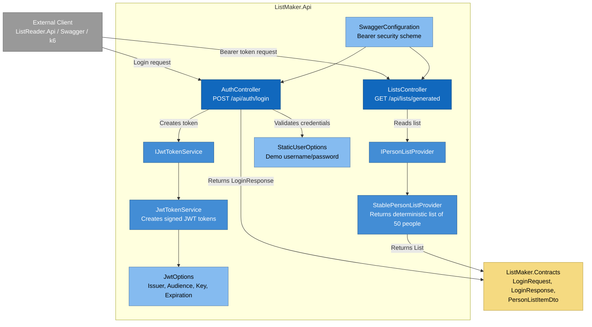

# C4 Model — Component Diagram: ListMaker.Api

## Purpose

This diagram shows the main internal components of `ListMaker.Api`.

`ListMaker.Api` is responsible for:

1. authenticating configured users
2. issuing JWT tokens
3. protecting the generated-list endpoint
4. returning a stable seeded list of 50 entries

---

## Component Diagram

---

## Main Components

| Component | Responsibility |
|---|---|
| `AuthController` | Accepts login request and returns JWT token |
| `ListsController` | Returns protected generated list |
| `IJwtTokenService` | Abstraction for JWT generation |
| `JwtTokenService` | Creates signed JWT tokens |
| `IPersonListProvider` | Abstraction for list generation |
| `StablePersonListProvider` | Produces stable list of 50 person records |
| `JwtOptions` | JWT configuration |
| `StaticUserOptions` | Static demo credentials |
| `SwaggerConfiguration` | Adds Swagger JWT bearer support |

---

## Main Endpoints

| Endpoint | Method | Auth Required | Description |
|---|---:|---:|---|
| `/api/auth/login` | POST | No | Authenticates configured user and returns JWT |
| `/api/lists/generated` | GET | Yes | Returns stable seeded list |

---

## List Data Contract

Each generated list entry contains:

| Field | Type | Rule |
|---|---|---|
| `name` | string | Max 50 characters |
| `family` | string | Max 50 characters |
| `age` | integer | Between 18 and 65 |
| `gender` | string | `male`, `female`, or `non-binary` |

---

## Design Notes

`ListMaker.Api` intentionally uses stable seeded data instead of truly random output.

Reason:

- repeatable tests
- predictable load testing
- easier demo verification
- deterministic API behavior

This is correct for this demo project.

