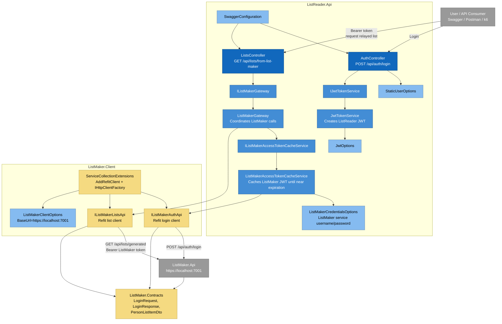

# C4 Model — Component Diagram: ListReader.Api

## Purpose

This diagram shows the main internal components of `ListReader.Api`.

`ListReader.Api` is responsible for:

1. authenticating external users
2. protecting its relay endpoint
3. obtaining a service JWT token from `ListMaker.Api`
4. caching the ListMaker token until near expiration
5. calling `ListMaker.Api` through Refit
6. returning the ListMaker list data to the caller

---

## Component Diagram


---

## Main Components

| Component | Responsibility |
|---|---|
| `AuthController` | Authenticates external users and returns ListReader JWT |
| `ListsController` | Exposes protected relay endpoint |
| `IListMakerGateway` | Abstraction for ListMaker integration |
| `ListMakerGateway` | Coordinates token retrieval and list retrieval |
| `IListMakerAccessTokenCacheService` | Abstraction for service-token caching |
| `ListMakerAccessTokenCacheService` | Logs in to ListMaker and caches token |
| `IListMakerAuthApi` | Refit client for ListMaker login |
| `IListMakerListsApi` | Refit client for ListMaker list endpoint |
| `ListMakerCredentialsOptions` | Stores service credentials for ListMaker |
| `ListMakerClientOptions` | Stores ListMaker base URL |
| `SwaggerConfiguration` | Adds Swagger JWT bearer support |

---

## Main Endpoints

| Endpoint | Method | Auth Required | Description |
|---|---:|---:|---|
| `/api/auth/login` | POST | No | Authenticates user and returns ListReader JWT |
| `/api/lists/from-list-maker` | GET | Yes | Calls ListMaker and returns generated list |

---

## API-to-API Flow

```text
User
  -> ListReader.Api
-> IListMakerGateway
-> IListMakerAccessTokenCacheService
-> IListMakerAuthApi
-> ListMaker.Api login
-> IListMakerListsApi
-> ListMaker.Api generated list
```

---

## Design Notes

`ListReader.Api` does not know ListMaker implementation details.

It only knows:

1. ListMaker base URL.
2. ListMaker login contract.
3. ListMaker list contract.
4. ListMaker service credentials.

This keeps the systems properly separated.

