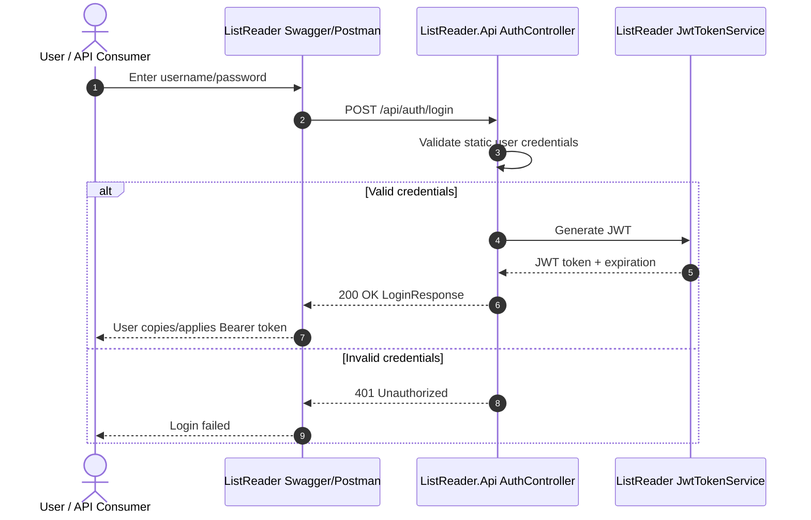
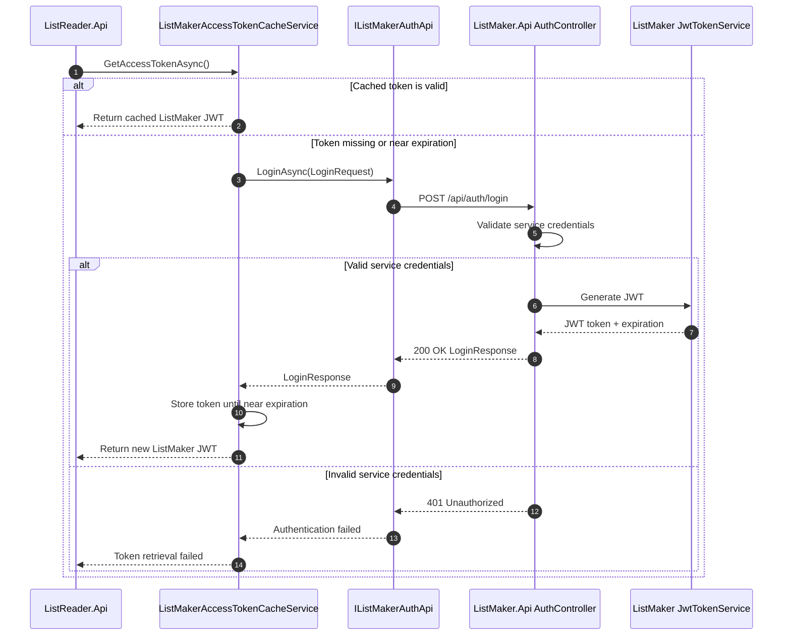

# Sequence Diagram — Authentication

## Purpose

This document shows the authentication flows for both APIs.

There are two authentication flows:

1. External user logs in to `ListReader.Api`.
2. `ListReader.Api` logs in to `ListMaker.Api` using service credentials.

---

## User Login to ListReader.Api


---

## ListReader.Api Login to ListMaker.Api



---

## Authentication Notes

Both APIs have separate JWT configuration.

This is intentional because they are treated as independent systems.

`ListReader.Api` authenticates the external user.

`ListMaker.Api` authenticates the service/client that calls it.

---

## Swagger Authentication

Both APIs configure Swagger/OpenAPI with a bearer token security definition.

Manual Swagger usage:

1. Call `/api/auth/login`.
2. Copy the returned token.
3. Click Swagger `Authorize`.
4. Enter:

```text
Bearer {token}
```

5. Call protected endpoints.
