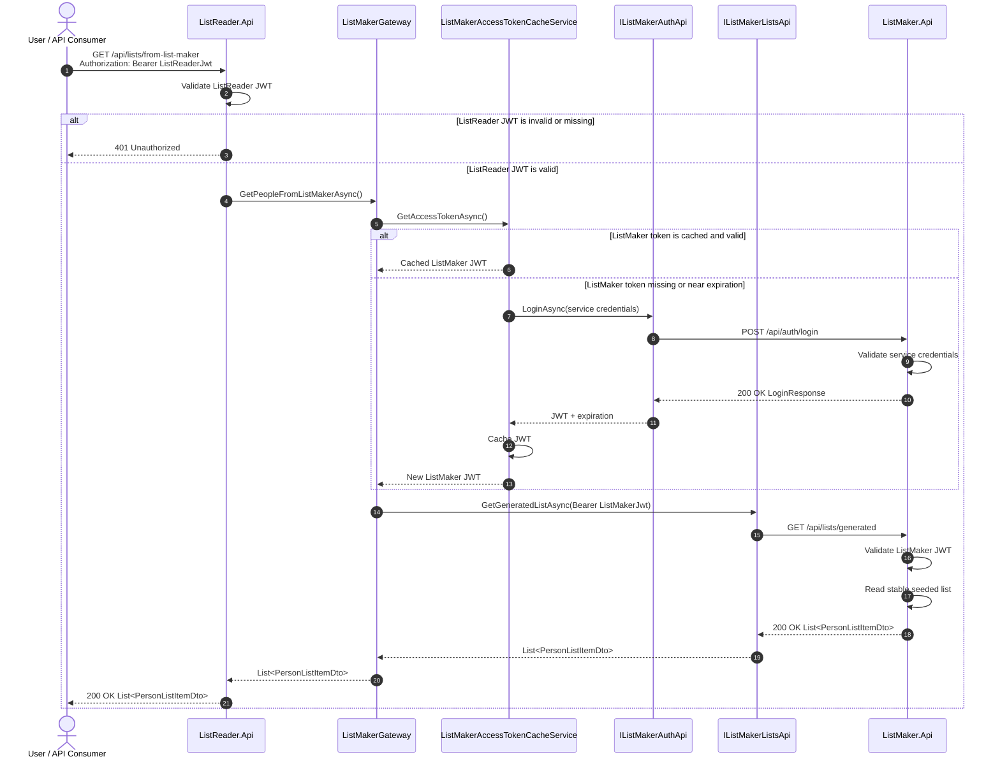

# Sequence Diagram — ListReader Relay Flow

## Purpose

This document shows how `ListReader.Api` calls `ListMaker.Api` and returns the generated list to the external user.

This is the central API integration flow of the project.

---

## Relay Sequence


---

## Flow Summary

The successful relay flow is:

```text
User logs in to ListReader.Api
User calls protected ListReader relay endpoint
ListReader validates user JWT
ListReader gets or refreshes ListMaker service JWT
ListReader calls ListMaker.Api through Refit
ListMaker validates service JWT
ListMaker returns generated list
ListReader returns the list to the user
```
---

## Why Token Caching Exists

Without token caching, `ListReader.Api` would call `ListMaker.Api` login endpoint before every relayed list request.

That would cause:

- unnecessary authentication traffic
- higher latency
- worse load-test results
- noisy logs/metrics

The accepted decision is:

```text
Cache the token until near expiration.
```

This is the correct design for this demo.
