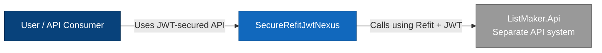
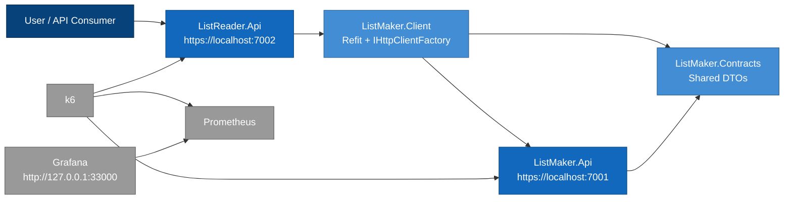
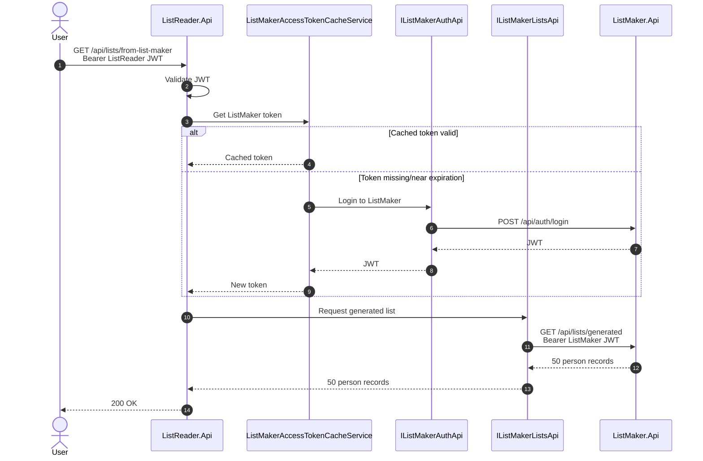
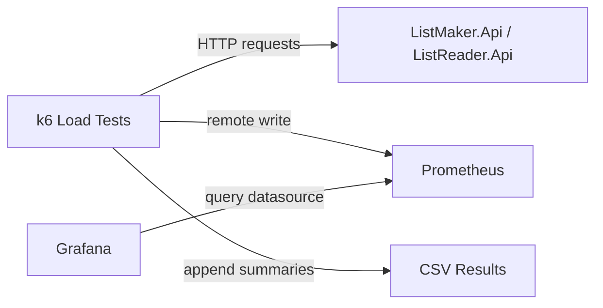

# Architecture Diagrams

This document provides a single index of the main architecture diagrams for `SecureRefitJwtNexus`.

---

## 1. System Context

---

## 2. Container Diagram

---

## 3. Main Runtime Flow

---

## 4. Observability Flow

---

## Documentation Links

Detailed diagrams are available here:

- [C4 Context](./c4-context.md)
- [C4 Container](./c4-container.md)
- [C4 Component - ListMaker.Api](./c4-component-listmaker.md)
- [C4 Component - ListReader.Api](./c4-component-listreader.md)
- [Authentication Sequence](./sequence-authentication.md)
- [ListReader Relay Sequence](./sequence-listreader-relay.md)
- [Observability](./observability.md)
