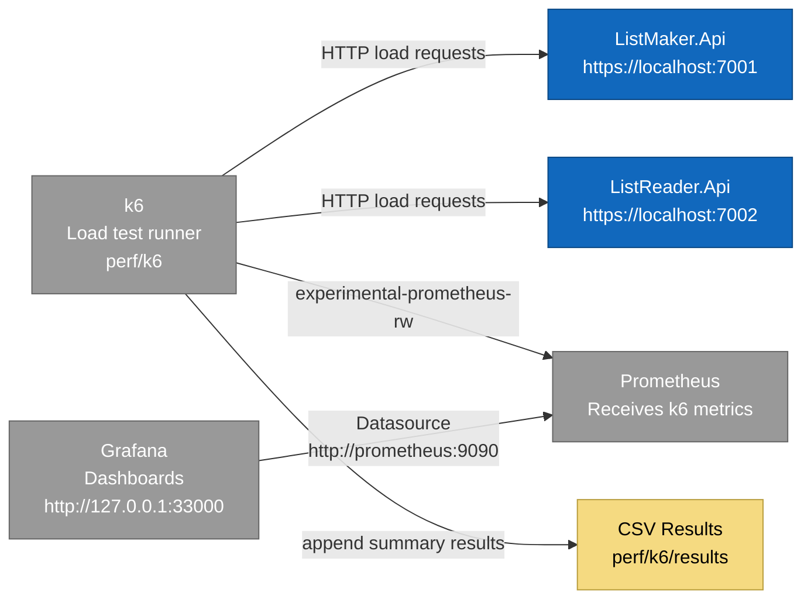

# Observability Architecture

## Purpose

This document describes the local observability setup used for load testing.

The stack contains:

- k6
- Prometheus
- Grafana

---

## Observability Diagram


---

## Folder Structure

```text
perf/
├── README.md
├── docker-compose.grafana.yml
│
├── prometheus/
│   └── prometheus.yml
│
├── grafana/
│   ├── dashboards/
│   │   └── grafana-k6-dashboard.json
│   │
│   └── provisioning/
│       ├── dashboards/
│       │   └── dashboards.yml
│       └── datasources/
│           └── datasource.yml
│
└── k6/
├── README.md
├── run-all-load-tests.ps1
├── run-listmaker-generated-list-load.ps1
├── run-listmaker-login-load.ps1
├── run-listreader-login-load.ps1
├── run-listreader-relay-load.ps1
├── append-results.ps1
├── config/
├── helpers/
├── results/
└── *.js
```

---

## Grafana Port

Grafana is exposed on:

```text
http://127.0.0.1:33000
```

The container still uses Grafana's default internal port:

```text
3000
```

The host mapping is:

```text
127.0.0.1:33000:3000
```

This avoids Windows-reserved port conflicts around ports `3000` and `3001`.

---

## Prometheus Datasource

Grafana connects to Prometheus using the Docker Compose service name:

```text
http://prometheus:9090
```

This is correct inside the Docker network.

Do not configure Grafana datasource as:

```text
http://localhost:9090
```

because inside the Grafana container, `localhost` means the Grafana container itself.

---

## k6 Metrics Flow

The k6 PowerShell runners publish metrics using:

```text
-o experimental-prometheus-rw
```

The runners also configure remote write timing, for example:

```powershell
$env:K6_PROMETHEUS_RW_PUSH_INTERVAL = "5s"
```

---

## k6 Tags

The k6 runners use tags for better Grafana filtering:

| Tag | Description |
|---|---|
| `test_name` | Name of the load test |
| `run_id` | Unique execution identifier |
| `k6_env` | Target environment |

These tags allow filtering by scenario and execution.

---

## Dashboard Persistence

Dashboards created or modified in the Grafana UI are stored in the Docker volume:

```text
grafana-data
```

To preserve dashboards in Git:

1. Open Grafana.
2. Export the dashboard as JSON.
3. Save the exported file under:

```text
perf/grafana/dashboards/
```

4. Commit the JSON file.

---

## Known Performance Note

The `ListReader.Api` relay endpoint is expected to be slower than direct `ListMaker.Api` endpoints because it includes an extra downstream HTTP call:

```text
Client -> ListReader.Api -> ListMaker.Api -> ListReader.Api -> Client
```

A higher p95 latency on the relay endpoint should be treated as a performance finding unless it is accompanied by:

- unexpected HTTP 500 responses
- high HTTP failure rate
- timeout failures
- incorrect response data